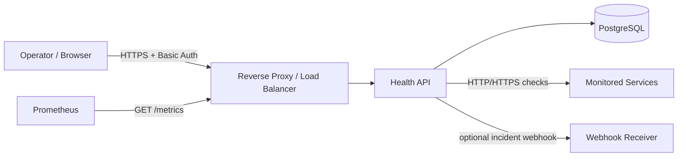
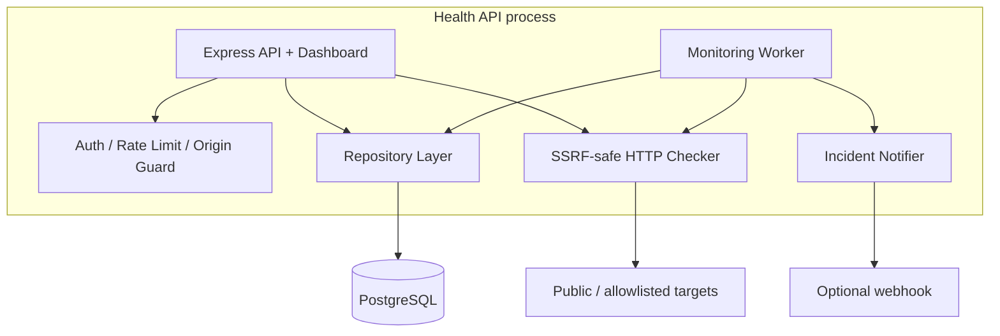
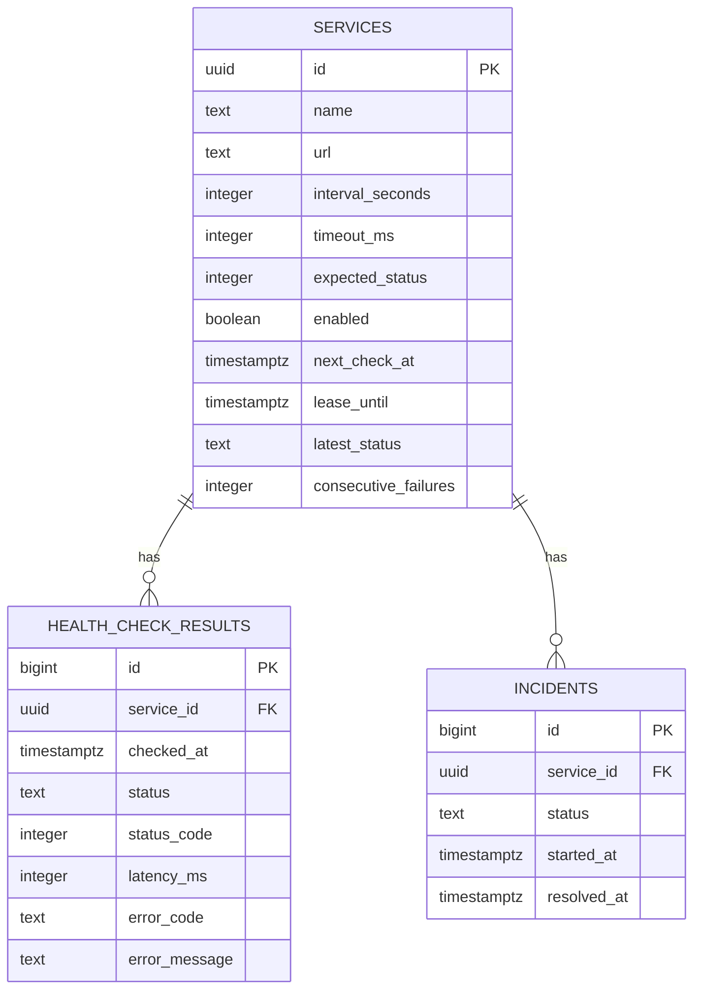
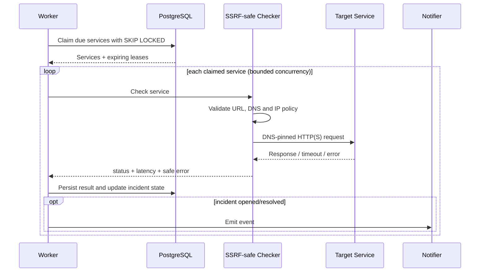

# Architecture

Health API is intentionally small: one Node.js application, PostgreSQL as the durable state/coordination layer, and an optional reverse proxy in front of the service.

## System context

## Runtime components

## Data model

## Background check flow

## Multi-instance coordination

PostgreSQL is used for both persistence and lightweight work coordination. `FOR UPDATE SKIP LOCKED` prevents multiple workers from claiming the same service inside the claim transaction. A time-bounded `lease_until` remains after the transaction so long-running network checks do not overlap across replicas. If a worker crashes, the lease expires and the service becomes claimable again.

## Security boundaries

- The dashboard and management API are authenticated.
- Liveness/readiness probes are intentionally unauthenticated.
- `/metrics` is authenticated.
- Target URLs are treated as untrusted input.
- Outbound requests are constrained by the SSRF policy and DNS pinning.
- PostgreSQL is not published to the host in the provided Compose topology.
- TLS is a deployment boundary and must be terminated by a trusted proxy/load balancer.

## Scaling model

For the intended single-tenant/admin-facing deployment, PostgreSQL coordination avoids an additional queue dependency. Multiple API/worker replicas can share the same database. At larger public scale, add an external distributed rate limiter and consider separating API and worker processes operationally.
