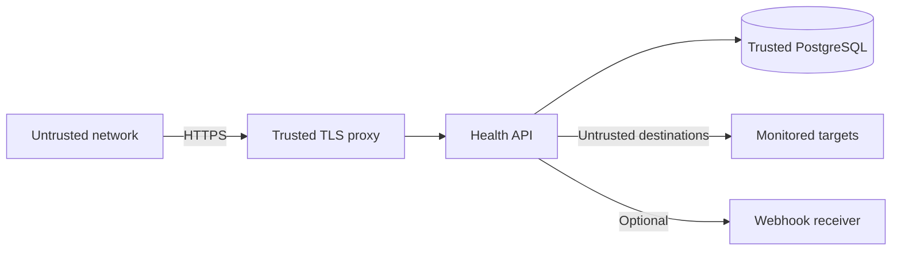

# Threat Model

## Scope

This threat model covers the Health API application, its PostgreSQL database, the web dashboard, management API, monitoring worker, outbound HTTP(S) checks, and optional incident webhook.

## Assets

- Administrative credentials.
- Service definitions and target URLs.
- Monitoring history and incident state.
- PostgreSQL credentials and data.
- Network reachability available to the Health API host.
- Webhook tokens and destinations.

## Trust boundaries

The most important boundary is outbound monitoring: target URLs are operator-controlled input but must still be treated as untrusted because a compromised account or configuration mistake could otherwise turn the monitor into an internal network probe.

## Primary threats and controls

| Threat | Risk | Controls |
|---|---|---|
| SSRF to localhost/private/metadata services | High | HTTP(S)-only URLs, credentials rejected, IPv4/IPv6 special-range blocking, DNS validation, connection pinning, redirect re-validation, explicit allowlist |
| DNS rebinding | High | Connect to the validated resolved IP rather than resolving again implicitly |
| Unauthorized management access | High | Basic Auth, fail-closed production config, long password requirement, TLS deployment requirement |
| Online password guessing | Medium | Global rate limit; use external distributed limiter for multiple public replicas |
| CSRF/browser cross-site mutations | Medium | Fetch Metadata and Origin checks for mutation methods |
| XSS in dashboard | Medium | Escaped rendered values, CSP, no inline application scripts |
| Database credential disclosure | High | Environment-provided secrets, `.env` excluded from Docker build context, database not host-published in Compose |
| Monitoring storm / resource exhaustion | Medium | Bounded worker concurrency, explicit manual-check rate limit, cached dashboard status |
| Duplicate checks across replicas | Medium | `SKIP LOCKED` plus expiring service leases |
| Alert delivery failure corrupts state | Low | Persist state before webhook notification; notification is best-effort |
| Stale worker lease after crash | Low | Time-bounded lease automatically expires |
| Dependency vulnerability | Medium | lockfile, `npm audit` CI gate, Dependabot, CodeQL |
| Container breakout amplification | Medium | Non-root user, read-only filesystem, dropped capabilities, no-new-privileges |

## Authentication note

The application uses Basic Auth because the intended deployment is single-tenant/admin-facing and expected to sit behind HTTPS. It is not a suitable identity model for multi-user SaaS. If the product evolves to multiple operators or tenants, move to an external identity provider or a session/token model with RBAC and audit logging.

Credential equality uses a padded `crypto.timingSafeEqual` comparison. The application does **not** use SHA-256 or another fast general-purpose hash as a password-hashing mechanism.

## SSRF policy details

Targets are rejected when they resolve to loopback, private, link-local, multicast, metadata-style, documentation, or other blocked special-use address ranges unless an explicit hostname policy allows the destination.

Every redirect is treated as a new destination and revalidated. This prevents a public URL from being used only as a redirect trampoline into an internal network.

## Residual risks

- In-memory rate limiting is per process. Multiple public replicas need a shared limiter.
- A deliberately broad `ALLOW_PRIVATE_TARGETS=true` weakens SSRF isolation by design.
- Basic Auth depends on TLS confidentiality.
- The supplied Compose topology is not a complete host-hardening or Kubernetes security policy.
- No egress firewall is configured by the application. High-assurance deployments should combine application SSRF controls with network-level egress policy.

## Security validation

The repository includes SSRF-focused tests and CodeQL analysis. Security findings should be treated as release blockers when they affect authentication, outbound target validation, database safety, or secret handling.
